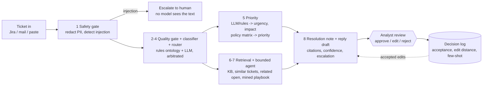

# TriageMate - architecture

## One picture

Teal = automated, purple = human, amber = stores. Every model-dependent node has a deterministic fallback: the system degrades, it does not fail.

## Nodes (module -> what it does -> how it is proven)

| # | Node | Module | Algorithm | Fallback | Proof |
|---|------|--------|-----------|----------|-------|
| 1 | Safety gate | `safety.py` | regex + first-name gazetteer redaction to typed tokens (`[PERSON_1]`, `[EMAIL_EXTERNAL_1]` ...), precision-first injection patterns (EN/DE/FR + hidden HTML/zero-width), ticket text only ever sent inside a delimited data block | regex-only redaction | `test_privacy_invariant_no_raw_pii_reaches_the_model` records every byte sent to a mock provider; injected tickets send **zero** bytes |
| 2 | Quality gate | `classify.py` | unclear = intake type / self-described / too few informative tokens / no identifiable service; asks, never guesses | rules only | clarification recall 1.0 on stress + validation |
| 3 | Classifier | `classify.py`, `llm_tasks.py` | ontology term scoring (summary x2, description x1) with **contrast suppression** ("rather than X") and **completed-context** ("already matched"), plus playbook votes; LLM sees the ranking as advisory hints; arbitration keeps the ontology answer when it is much stronger and the LLM unsure | ontology only | stress set, post-freeze validation, holdout |
| 4 | Router | `catalogue.py` | `TEAM_OF[service]`, asserted 1:1 against all 20,000 training tickets | - | `test_catalogue_matches_training_data_1_to_1` |
| 5 | Priority | `priority.py` | model/rules supply **urgency + impact with evidence**; the README's 5x5 matrix computes the priority **in code**; clamps keep non-critical services out of "Major" | rule cues (EN/DE/FR) | 25 matrix cells tested cell-by-cell; consistency 1.0 over repeated runs |
| 6 | Retrieval | `retrieve.py` | own BM25 + dense (OpenAI embeddings, or offline TF-IDF/LSA) fused `0.6 cos + 0.4 bm25`, service filter, floor; **playbook mined from the training comments** | offline embedder | citation ids resolve; `test_playbook_is_mined_from_data_not_hardcoded` |
| 7 | Agent loop | `agent.py` | model picks read-only tools (`search_kb`, `find_similar_tickets`, `find_open_related`, `request_clarification`, `escalate_to_human`), **hard budget 5**; tools only *recommend* - code decides | deterministic policy plan | `test_agent_tool_budget_is_hard`, tool guardrails (see below) |
| 8 | Draft | `draft.py`, `llm_tasks.py` | reply + internal next steps as typed JSON; every factual sentence ends with `[KB-xx]`; one repair pass; `INSUFFICIENT_EVIDENCE` escape hatch; same language as the ticket | template draft from KB "requester reply points" | citation coverage metric |
| 9 | Analyst UI | `ui/index.html`, `api.py` | queue with badges, redaction toggle, reasons, matrix, citations, trace, approve/edit/reject | - | verified in browser |
| 10 | Feedback | `store.py` | every decision logged (edit distance, dwell); accepted edits become the base/few-shot for the same service+work-type pattern | - | `test_feedback_loop_reuses_approved_reply` |

## Design decisions that came from the data

1. **Service -> team is strictly 1:1** -> routing is a lookup, not a model.
2. **Priority, urgency, impact, assignee, resolution outcome and resolution time are statistically independent of everything** in the training set (`python -m triagemate.cli analyze`) -> we compute priority from evidence with the README matrix and use a load-balancing policy for assignees instead of pretending to predict them.
3. **Only 173 unique texts** -> accuracy on the dataset is leakage (TF-IDF + logistic regression gets 100% on service and work type); we evaluate on separately authored stress and validation sets.
4. **The real signal is in the comments**: 21 human-written resolution notes (10 services) hide among 79 unique comment bodies. They are found by a data-driven filter (long, repeated, bound to one service; boilerplate templates are recognised by name-substitution variants) - not hardcoded - and drive both the resolution note and (as votes) the service inference.

## Agent guardrails (why the model cannot make the product worse)

* Tools are **read-only**; `request_clarification` / `escalate_to_human` only recommend.
* A recommendation is honoured only if the deterministic quality gate agrees (found live: a model misled by a template match tried to ask for clarification on a clear ticket - now rejected with a tool message).
* Retrieval always uses the masked ticket text, not the model's free-form query.
* Injection is decided **before** any model runs; an injected ticket is escalated with zero model calls.
* Personal-data tokens are restored into the analyst-facing draft only, never into resolution notes.

## Provider layer

One OpenAI-compatible interface (`llm.py`): `openai`, `apertus` (Swisscom, 5 req/s throttle), `azure`, `local`; Claude via the official SDK in `llm_anthropic.py`. Per-role providers (`CLASSIFY_PROVIDER`, `DRAFT_PROVIDER`). Retries, `Retry-After`, circuit breaker, JSON mode with prompt-only fallback, typed output with one repair pass (examples not schemas - models imitate schema keywords), token/cost accounting per ticket.

## Latency design

Independent model calls run concurrently: classification || urgency/impact (speculative on the rules' service, recomputed only if it changes) -> priority finalisation || agent loop -> resolution note || draft. Batches process several tickets at once; assignment stays sequential so results are deterministic. `AGENT_MODE=policy` skips the LLM tool loop for the fastest path.
