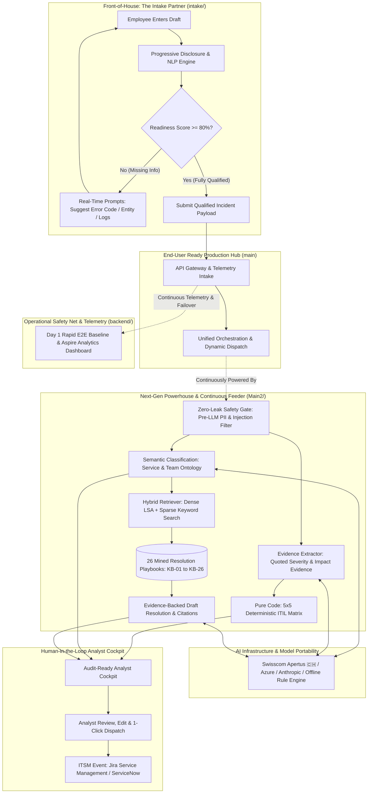

# 🤝 team8 (`team_mate`)
### *The Enterprise Incident Intake & Triage Teammate*

> ### *"Thanks team8, you did gr8!"* 🚀
> 
> **"The best ticket is the one that never gets created. And when support is needed, it should arrive with everything required to act."**

[](https://www.apertus-ai.org/)
[](https://github.com/DaPres/SwissAiWeeks_Team_8/blob/main/README.md#1-zero-leak-safety-gate-pre-llm-pii-shield)
[](https://github.com/DaPres/SwissAiWeeks_Team_8/blob/main/README.md#-challenge-reference-itil-matrix--critical-services)
[](#compound-ai-architecture)
[](#quickstart)

---

## ⚡ Executive Quick Links

| 🎥 **[60s Split-Screen Movie Script](pitch/FinalPitchPlaybook.md#1-the-60-second-split-screen-movie-timeline)** | 📖 **[3-Min Jury Q&A Defense](pitch/FinalPitchPlaybook.md#4-master-3-minute-jury-qa-defense-playbook)** | 🌐 **[Intake UI (`intake/`)](intake/)** | ⚙️ **[Next-Gen Engine (`Main2/`)](Main2/)** | 📊 **[Fast Baseline (`backend/`)](backend/)** | 📋 **[Challenge Brief](CHALLENGE.md)** |
|---|---|---|---|---|---|

---

## 💡 Executive Summary: Solving Enterprise Support at Both Ends

Enterprise IT service desks face a compounding double-sided challenge:
1. **The Requester Problem (Ticket Ping-Pong):** Employees submit vague, under-specified tickets (*"SAP is down"*, *"system broken"*). This triggers 2 to 3 back-and-forth round trips just to gather diagnostic logs and error codes, delaying Mean Time to Resolution (MTTR) by **24 to 48 hours**.
2. **The Analyst Problem (Cognitive Overload & Hallucinations):** L2 support analysts sift through unstructured text, manually redact sensitive customer/employee PII, guess priorities subjectively, and search for historical resolutions across outdated wikis.

**team8** resolves both ends of the lifecycle simultaneously by merging the **best of both backend worlds** into our production system:

* **Front-of-House (The Guided Intake Partner — `intake/`):** Progressive disclosure and real-time guidance detect missing diagnostic dimensions as the requester types. An **80% readiness gate** prevents incomplete tickets from entering the queue in the first place.
* **The Unified Production App (`main`):** Both backends offered unique, powerful advantages. Our Day 1 backend gave us immediate operational readiness, rapid dispatch, and an Aspire telemetry dashboard, while the next-gen architecture introduced deep mathematical determinism and safety. We synthesized the best of both worlds and merged them into `main` to deliver a cohesive, end-user ready application.
* **The Next-Gen Powerhouse (`Main2/`):** Treated as our super-sophisticated, future-proof, and horizontally scalable next-gen option. Featuring pre-LLM PII scrubbing, deterministic mathematical **5×5 ITIL priority scoring**, hybrid retrieval across **26 mined Knowledge Base playbooks (`[KB-01]` to `[KB-26]`)**, and real-time typing-assist APIs, `Main2` serves as the high-capability engine that constantly feeds into and upgrades the end-user ready main app.
* **Universal Work Management Extensibility:** While built and validated specifically for **IT Service Management (ITSM)** to solve the hackathon challenge, the underlying Compound AI architecture is **domain-agnostic**. The intake readiness gates, deterministic policy engines, PII shields, and hybrid playbook retrieval are easily trainable and extendable to **Agile sprint planning, project & portfolio management (PPM), HR operations, and all enterprise work item tracking**.

---

<a id="compound-ai-architecture"></a>
## 🏗️ Compound AI Architecture: Best of Both Worlds

Rather than relying on a fragile, monolithic LLM prompt, **team8** is engineered as a **Compound AI System**. 

During development, we evaluated two distinct backend approaches and found that both offered crucial enterprise advantages: our rapid Day 1 baseline provided lightweight, rock-solid end-to-end dispatch and telemetry, while **Main2** introduced high-precision mathematical determinism, PII safety gating, and hybrid semantic retrieval. We merged the best of both worlds into our end-user ready `main` application, while maintaining **Main2** as the advanced, future-proof, and scalable next-gen engine that continuously feeds the production platform with state-of-the-art triage capabilities.



---

## 🛡️ The Four Enterprise Pillars (Why team8 Wins)

By uniting the operational robustness of our baseline with the advanced cognitive architecture of **Main2**, **team8** delivers enterprise-grade reliability across four core pillars:

<a id="1-zero-leak-safety-gate-pre-llm-pii-shield"></a>
<a id="1-zero-leak-safety-gate-pii-shield"></a>
### 1. Zero-Leak Safety Gate (Pre-LLM PII Shield)
* **Pre-LLM Sanitization:** Regex + Named Entity Recognition scrub IBANs, credit card numbers, email addresses, phone numbers, and employee names before any payload is sent to an LLM provider.
* **Prompt Injection Defense:** Multi-lingual jailbreak and prompt-injection filters intercept adversarial input at the API gateway.

### 2. Deterministic 5×5 ITIL Priority Engine
* **Zero Hallucination Priority:** Putting an LLM directly in charge of ITIL priority violates enterprise SLAs. 
* **The Solution:** The LLM only extracts *quoted evidence* from the description (e.g., *"Full trading platform outage, 4 financial counterparties blocked"*). Deterministic Python code maps the assessed Urgency and Impact onto the **official 5×5 ITIL Matrix** (100% mathematical consistency).

### 3. Swiss AI Sovereignty & Model Portability
* **Swisscom Apertus Native:** Built for Swiss financial compliance, team8 natively supports **Swisscom Apertus** to keep data strictly within Swiss borders.
* **Multi-Provider Fallback:** Seamlessly swaps between Swisscom Apertus, Azure OpenAI, Anthropic Claude, and an **offline rule-based LSA engine** with zero external network dependencies.

### 4. Grounded Resolution Notes with Cited Evidence
* **Mined Knowledge Base:** We analyzed the historical training dataset and distilled 26 canonical playbooks ([`Main2/kb/KB-01.md`](Main2/kb/KB-01.md) through [`KB-26.md`](Main2/kb/KB-26.md)).
* **Mandatory Citation Tags:** Drafted resolutions must cite the exact `[KB-xx]` playbook and reference quoted incident facts. No generic filler like *"issue fixed"*.

---

## 🌐 Beyond ITSM: Extensible to Universal Enterprise Work Management

> [!NOTE]
> **Current Challenge Focus:** **team8** is tailored and benchmarked for **IT Service Management (ITSM)** and ITIL incident triage under the Swiss AI Weeks Challenge. However, our modular Compound AI architecture is explicitly designed to be **domain-agnostic and horizontally extendable** to any work item or workflow management system.

Because the system cleanly decouples **intake guidance**, **PII safety interception**, **deterministic mathematical policy calculation**, and **playbook retrieval**, adapting the platform to new enterprise domains requires zero fundamental architectural changes:

| Work Management Paradigm | Intake Guidance Dimensions | Deterministic Policy Engine (Pure Code) | Retrieval Knowledge Base | Target Assignee Teams |
| :--- | :--- | :--- | :--- | :--- |
| **IT Service Management (Current)** | Error logs, affected users, business impact, environment | **5×5 ITIL Priority Matrix**<br>*(Urgency × Impact)* | 26 Mined Incident Playbooks (`KB-01` to `KB-26`) | L2 Core ERP, Database Ops, Cloud Infra, Network |
| **Agile & Scrum Delivery** | User stories, acceptance criteria, reproduction steps, sprint goals | **WSJF, RICE, or MoSCoW Scoring**<br>*(Reach × Impact × Confidence / Effort)* | Definition of Done (DoD), Architecture Decision Records (ADRs) | Feature Squads, Platform Eng, QA / Automation |
| **Project & Portfolio Management (PPM)** | Milestone dates, resource dependencies, deliverables, budget impact | **Critical Path Risk & Governance Matrix**<br>*(Schedule Risk × Financial Exposure)* | PMBOK / PRINCE2 execution templates, corporate governance rules | PMO, Steering Committees, Workstream Leads |
| **HR & Employee Operations** | Request category, jurisdiction, employee tier, urgency | **SLA Escalation & Confidentiality Tiering**<br>*(Role Tier × Sensitivity)* | HR Policies, Benefits Handbook, Collective Labor Agreements | People Ops, Payroll, Talent Acquisition, Legal |
| **Legal & Compliance Case Triage** | Regulatory jurisdiction, filing deadlines, monetary exposure | **Compliance Risk Scoring**<br>*(Filing Deadline × Exposure Tier)* | Regulatory Frameworks (GDPR, FINMA, Basel III, ISO 27001) | Compliance Officers, In-house Counsel, Risk Audit |

### Why Retraining & Extension is Fast and Frictionless:
1. **Configurable Readiness Markers:** The 5-marker qualification evaluator in [`intake/quality.py`](intake/quality.py) can be reconfigured via simple JSON schema to require user story acceptance criteria, project risk assessments, or HR case details instead of IT error logs.
2. **Pluggable Pure-Code Policy Rules:** The priority calculation in [`Main2/triagemate/priority.py`](Main2/triagemate/priority.py) is deterministic Python code. Replacing the 5×5 ITIL matrix with WSJF, RICE, or project risk matrices takes minutes, ensuring 100% mathematical consistency without LLM hallucinations.
3. **Zero-Code Playbook Extension:** New domains simply add markdown playbooks into `kb/` (e.g., agile DoD templates or compliance checklists). The dense LSA + sparse hybrid retriever automatically vectorizes and indexes them without retraining any neural models.
4. **Universal Work Item Export:** The dispatch payload seamlessly maps to Jira Software issues, GitHub Issues, Azure DevOps work items, ServiceNow cases, or Asana tasks.

---

## 🔍 Data Forensics: Why Naive AI Fails

Before writing code, our team performed deep data forensics on the **20,000 synthetic Jira tickets**:
* **The Reality:** The 20,000 synthetic tickets collapse into **only 173 unique text descriptions** derived from 11 repeating templates.
* **The Trap:** Priority, Urgency, and Assignees in the raw training dataset were statistically independent, uncorrelated noise.
* **The Engineering Takeaway:** Any team that naively fine-tuned an LLM or trained a black-box classifier on raw ticket fields essentially trained their model to hallucinate noise. We used the training data strictly to mine the service ontology and resolution patterns, relying on deterministic rules for the priority matrix. This forensic realization guided our decision to merge the battle-tested reliability of our baseline with the deep deterministic reasoning of the **Main2** engine.

---

## 👥 Our Team's Development Journey: Taking the Best of Both Worlds

```
                             ┌──► 1. Rapid E2E Baseline (backend/) ─────────────┐
                             │    (Lightweight flow, instant telemetry, safety) │
[ 20k Dataset Forensics ] ───┼──► 2. Specialized Intake Partner (intake/)       ├──► [ Best-of-Both-Worlds on `main` ]
(Only 173 unique texts;      │    (Progressive disclosure & live enrichment)    │    (End-user ready main app,
 83% noise / misleading      └──► 3. Next-Gen TriageMate Engine (Main2/) ───────┘     continuously fed by Main2)
 titles)                          (Deterministic 5x5, PII gate, 26 KBs, scalable)
```

1. **Phase 1: Rapid Baseline & Operational Telemetry (`backend/`):** Built on Day 1 to map the full lifecycle from ticket intake to resolution dispatch. This gave us an immediate working baseline, end-to-end Aspire telemetry, and an operational safety net that de-risked delivery from hour zero.
2. **Phase 2: Parallel Deep Specialization (`intake/` & `Main2/`):**
   * **Stream A (Front-of-House):** Engineered the progressive Intake Partner ([`intake/`](intake/)) with live typing guidance, dynamic diagnostic prompts, and an 80% readiness gate.
   * **Stream B (Next-Gen Engine):** Engineered the super-sophisticated TriageMate engine ([`Main2/`](Main2/)) with zero-leak PII masking, 100% deterministic 5×5 ITIL matrix computation, dense/sparse hybrid retrieval across 26 mined KB playbooks, and multi-provider model portability.
3. **Phase 3: Flagship Convergence — Best of Both Worlds into `main`:**
   * **The Architectural Realization:** Rigorous testing revealed that both backends had distinct, irreplaceable advantages. The Day 1 backend provided lightweight simplicity, immediate production readiness, and comprehensive telemetry; `Main2` delivered supreme algorithmic sophistication, mathematical determinism, and future-proof scalability.
   * **The Synthesis:** Rather than choosing one and abandoning the other, we took the **best of both worlds and merged them directly into `main`**. The end-user ready application gains battle-tested operational stability, while **`Main2` remains our super-sophisticated, future-proof, and horizontally scalable next-gen option** that continuously feeds advanced triage intelligence and model upgrades into the main app.

---

<a id="quickstart"></a>
## 🚀 Quickstart & Reproducibility

### Option 1: Run the End-User Ready Intake Partner UI (`intake/`)
```bash
cd intake
npm install && npm run build
python3 server.py
# Open http://127.0.0.1:8080
```

### Option 2: Run the Next-Gen TriageMate Engine & Analyst Cockpit (`Main2/`)
*The super-sophisticated, future-proof, and scalable next-gen option that continuously feeds the production main app:*
```bash
cd Main2
pip install -r requirements.txt
cp .env.example .env                       # Optional: Add Swisscom Apertus, Azure, or OpenAI key
python3 -m triagemate.cli serve --port 8765 # Starts API + Analyst Cockpit
# Open http://127.0.0.1:8765
```

### Option 3: Run the Operational Baseline Backend & Telemetry (`backend/`)
*The lightweight, battle-tested operational safety net with Aspire telemetry:*
```bash
cd backend
pip install -r requirements.txt
python3 -m uvicorn app.main:app --port 8000
# Open http://127.0.0.1:8000
```

### Option 4: Run the Test Suites (100% Offline)
```bash
# Run Intake test suite (19 unit tests)
python3 -m unittest discover intake

# Run Next-Gen TriageMate core tests (offline mode with mock embeddings, 129 tests)
cd Main2 && pytest tests -q
```

---

## 📋 Challenge Reference: ITIL Matrix & Critical Services
*(For the full original hackathon problem statement and dataset description, see [`CHALLENGE.md`](CHALLENGE.md))*

### Incident Priority Calculation Matrix

| Urgency ⬇️ \ Impact ➡️ | **Major / Widespread**<br><sub>Critical IT down > 2h</sub> | **Significant / Large**<br><sub>Critical IT partial, 1+ entities</sub> | **Moderate / Limited**<br><sub>Non-critical IT down, 1 entity</sub> | **Minor / Localized**<br><sub>Non-critical IT partial, individuals</sub> | **No Direct Impact**<br><sub>Informational / maintenance</sub> |
| :--- | :--- | :--- | :--- | :--- | :--- |
| **Critical** | **Highest** | **Highest** | **High** | **Medium** | **Medium** |
| **High** | **Highest** | **High** | **High** | **Medium** | **Low** |
| **Medium** | **High** | **High** | **Medium** | **Low** | **Low** |
| **Low** | **Medium** | **Medium** | **Low** | **Low** | **Lowest** |
| **Lowest** | **Medium** | **Low** | **Low** | **Lowest** | **Lowest** |

### Critical Services List
* **Critical:** Trading Platform, Order Management, Trade Matching, Securities Settlement, Corporate Actions, Fund Pricing, NAV Calculation, Portfolio Accounting, Cash Management, Risk & Compliance Monitoring, Regulatory Reporting, SimCorp Dimension, Rimes Data Feed, Client Reporting.
* **Non-Critical:** Tax Reporting, CRM & Client Portal, Identity & Access Management, SharePoint & File Storage, Outlook & Email, Emailed Support Tickets.

---

## 📁 Repository Directory Structure

```text
SwissAiWeeks_Team_8/
│
├── 📂 pitch/                        # ─── PITCH PLAYBOOK & JURY Q&A ───
│   └── FinalPitchPlaybook.md        # 60s split-screen movie script & 3-min defense playbook
│
├── 📂 intake/                       # ─── FRONT-OF-HOUSE: INTAKE PARTNER ───
│   ├── src/                         # React progressive disclosure components & Geist UI
│   ├── server.py                    # Lightweight Python HTTP server & readiness validator
│   ├── suggestions.py               # Real-time field suggestion & diagnostic prompt engine
│   └── quality.py                   # 5-marker readiness evaluation & scoring logic
│
├── 📂 Main2/                        # ─── NEXT-GEN ENGINE & INNOVATION POWERHOUSE ───
│   │                                # Super-sophisticated, future-proof, scalable next-gen engine
│   │                                # that continuously feeds the end-user ready main app
│   ├── triagemate/                  # Core Python package
│   │   ├── safety.py                # Pre-LLM PII masking (IBAN, emails) & prompt defense
│   │   ├── priority.py              # Pure deterministic 5×5 ITIL Priority Matrix
│   │   ├── classify.py              # Semantic ontology & service classifier
│   │   ├── retrieve.py              # Dense LSA + Sparse hybrid retrieval
│   │   ├── resolutions.py           # Playbook resolution generator with cited evidence
│   │   ├── pipeline.py              # End-to-end orchestration pipeline
│   │   └── api.py                   # FastAPI endpoints (/triage, /assist)
│   ├── kb/                          # 26 mined historical Knowledge Base playbooks (KB-01 to KB-26)
│   └── ui/                          # Audit-ready L2 Support Analyst cockpit
│
├── 📂 backend/                      # ─── BATTLE-TESTED BASELINE & TELEMETRY ───
│   │                                # Lightweight Day 1 PoC, operational safety net & telemetry
│   ├── app/                         # FastAPI baseline triage service & Aspire telemetry
│   └── Dockerfile                   # Unified container deployment
│
└── 📂 triage-explorer/              # Day 1 triage analytics dashboard (Vite/React)
```

---

*Built with passion by **Team 8** for the **Swiss AI Weeks Hackathon 2026**.*  
*“Thanks team8, you did gr8!”* 🤝
