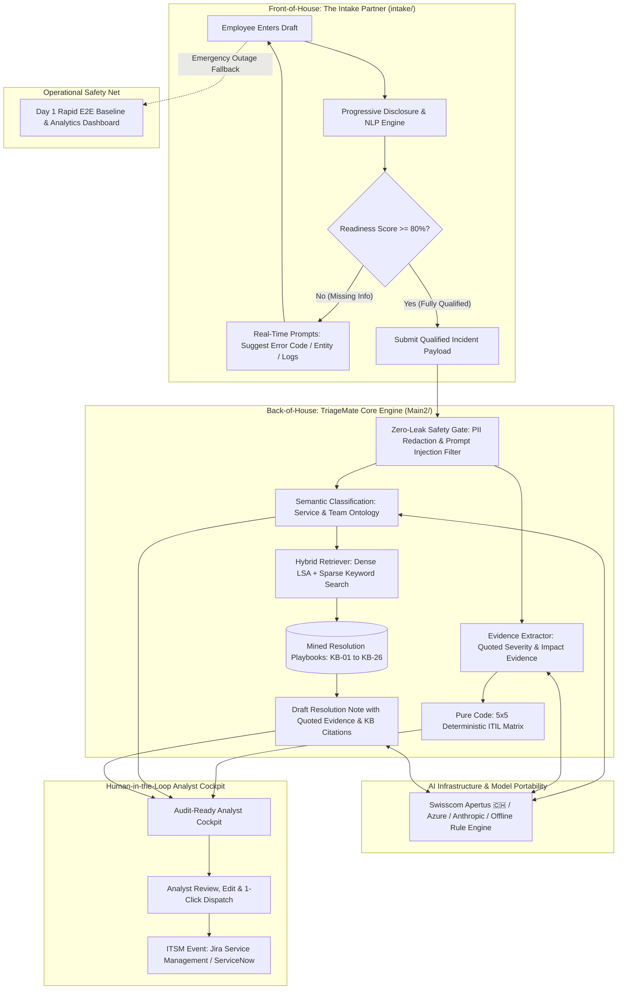

# 🤝 team8 (`team_mate`)
### *The Enterprise Incident Intake & Triage Teammate*

> ### *"Thanks team8, you did gr8!"* 🚀
> 
> **"The best ticket is the one that never gets created. And when support is needed, it should arrive with everything required to act."**

[](https://www.apertus-ai.org/)
[](#1-zero-leak-safety-gate-pii-shield)
[](#2-deterministic-55-itil-priority-engine)
[](#compound-ai-architecture)
[](#quickstart)

---

## ⚡ Executive Quick Links

| 🎥 **[60s Split-Screen Movie Script](pitch/FinalPitchPlaybook.md#1-the-60-second-split-screen-movie-timeline)** | 📖 **[3-Min Jury Q&A Defense](pitch/FinalPitchPlaybook.md#4-master-3-minute-jury-qa-defense-playbook)** | 🌐 **[Intake UI (`intake/`)](intake/)** | ⚙️ **[TriageMate (`Main2/`)](Main2/)** | 📊 **[Fast PoC](backend/)** | 📋 **[Challenge Brief](CHALLENGE.md)** |
|---|---|---|---|---|---|

---

## 💡 Executive Summary: Solving Enterprise Support at Both Ends

Enterprise IT service desks face a compounding double-sided challenge:
1. **The Requester Problem (Ticket Ping-Pong):** Employees submit vague, under-specified tickets (*"SAP is down"*, *"system broken"*). This triggers 2 to 3 back-and-forth round trips just to gather diagnostic logs and error codes, delaying Mean Time to Resolution (MTTR) by **24 to 48 hours**.
2. **The Analyst Problem (Cognitive Overload & Hallucinations):** L2 support analysts sift through unstructured text, manually redact sensitive customer/employee PII, guess priorities subjectively, and search for historical resolutions across outdated wikis.

**team8** resolves both ends of the lifecycle simultaneously:

* **Front-of-House (The Guided Intake Partner — `intake/`):** Progressive disclosure and real-time guidance detect missing diagnostic dimensions as the requester types. An **80% readiness gate** prevents incomplete tickets from entering the queue in the first place.
* **Back-of-House (The TriageMate Engine — `Main2/`):** Pre-LLM PII scrubbing, deterministic mathematical **5×5 ITIL priority scoring**, hybrid retrieval against **26 mined Knowledge Base playbooks (`[KB-01]` to `[KB-26]`)**, and evidence-backed draft resolutions for **1-click analyst approval**.
* **Operational Safety Net (Rapid E2E Baseline — `main` root):** Built on Day 1 to map the full lifecycle, serving as an active fallback and analytics dashboard.

---

<a id="compound-ai-architecture"></a>
## 🏗️ Compound AI Architecture

Rather than relying on a fragile, monolithic LLM prompt, **team8** is engineered as a **Compound AI System**: AI handles semantic parsing, evidence extraction, and text synthesis; pure deterministic code handles security gates, ITIL matrix calculation, and SLA enforcement.



---

## 🛡️ The Four Enterprise Pillars (Why team8 Wins)

### 1. Zero-Leak Safety Gate (Pre-LLM PII Shield)
* **Pre-LLM Sanitization:** Regex + Named Entity Recognition scrub IBANs, credit card numbers, email addresses, phone numbers, and employee names before any payload is sent to an LLM provider.
* **Prompt Injection Defense:** Multi-lingual jailbreak and prompt-injection filters intercept adversarial input at the API gateway.

### 2. Deterministic 5×5 ITIL Priority Engine
* **Zero Hallucination Priority:** Putting an LLM directly in charge of ITIL priority violates enterprise SLAs. 
* **The Solution:** The LLM only extracts *quoted evidence* from the description (e.g., *"Full trading platform outage, 4 financial counterparties blocked"*). Deterministic Python code maps the assessed Urgency and Impact onto the **official 5×5 ITIL Matrix** (100% mathematical consistency).

### 3. Swiss AI Sovereignty & Model Portability
* **Swisscom Apertus Native:** Built for Swiss financial compliance, team8 natively supports **Swisscom Apertus** to keep data strictly within Swiss borders.
* **Multi-Provider Fallback:** Seamlessly swaps between Swisscom Apertus, Azure OpenAI, Anthropic Claude, and an **offline rule-based LSA engine** with zero external network dependencies.

### 4. Grounded Resolution Notes with Cited Evidence
* **Mined Knowledge Base:** We analyzed the historical training dataset and distilled 26 canonical playbooks ([`Main2/kb/KB-01.md`](Main2/kb/KB-01.md) through [`KB-26.md`](Main2/kb/KB-26.md)).
* **Mandatory Citation Tags:** Drafted resolutions must cite the exact `[KB-xx]` playbook and reference quoted incident facts. No generic filler like *"issue fixed"*.

---

## 🔍 Data Forensics: Why Naive AI Fails

Before writing code, our team performed deep data forensics on the **20,000 synthetic Jira tickets**:
* **The Reality:** The 20,000 synthetic tickets collapse into **only 173 unique text descriptions** derived from 11 repeating templates.
* **The Trap:** Priority, Urgency, and Assignees in the raw training dataset were statistically independent, uncorrelated noise.
* **The Engineering Takeaway:** Any team that naively fine-tuned an LLM or trained a black-box classifier on raw ticket fields essentially trained their model to hallucinate noise. We used the training data strictly to mine the service ontology and resolution patterns, relying on deterministic rules for the priority matrix.

---

## 👥 Our Team's Development Journey (Dual-Track Agile Sprint)

```
                             ┌──► 1. Rapid E2E Baseline (Day 1 PoC & Fallback) ──┐
                             │    (Intake, triage, resolve & reporting dash)     │
[ 20k Dataset Forensics ] ───┼──► 2. Specialized Intake Partner (intake/)        ├──► [ Flagship Solution ]
(Only 173 unique texts;      │    (Progressive disclosure & live enrichment)     │    (Intake Partner +
 83% noise / misleading      └──► 3. Deep TriageMate Engine (Main2/)             │     TriageMate Core)
 titles)                          (Deterministic ITIL 5x5, PII gate, KB notes)   ─┘    [+ PoC Fallback]
```

1. **Phase 1: Rapid Baseline (Day 1 PoC):** One engineer built a functioning end-to-end prototype covering intake, triage, resolution proposals, and an Aspire reporting dashboard to de-risk delivery on day one.
2. **Phase 2: Parallel Deep Specialization:**
   * **Stream A (Front-of-House):** Engineered the progressive Intake Partner ([`intake/`](intake/)) with live typing guidance and an 80% readiness gate.
   * **Stream B (Back-of-House):** Engineered the TriageMate engine ([`Main2/`](Main2/)) with the PII safety gate, ITIL priority matrix, and evaluation harness.
3. **Phase 3: Flagship Convergence:** Merged both streams into `main` to create the unified **team8** product, keeping the Day 1 prototype as a battle-tested operational fallback.

---

<a id="quickstart"></a>
## 🚀 Quickstart & Reproducibility

### Option 1: Run the Intake Partner UI (`intake/`)
```bash
cd intake
npm install && npm run build
python3 server.py
# Open http://127.0.0.1:8080
```

### Option 2: Run the TriageMate Engine & Analyst UI (`Main2/`)
```bash
cd Main2
pip install -r requirements.txt
cp .env.example .env                       # Optional: Add Swisscom Apertus, Azure, or OpenAI key
python3 -m triagemate.cli serve --port 8765 # Starts API + Analyst Cockpit
# Open http://127.0.0.1:8765
```

### Option 3: Run the Test Suite (100% Offline)
```bash
# Run Intake test suite (19 unit tests)
python3 -m unittest discover intake

# Run TriageMate core tests (offline mode with mock embeddings)
cd Main2 && pytest tests -q
```

---

## 📋 Challenge Reference: ITIL Matrix & Critical Services
*(For the full original hackathon problem statement and dataset description, see [`CHALLENGE.md`](CHALLENGE.md))*

### Incident Priority Calculation Matrix

| Urgency ⬇️ \ Impact ➡️ | **Major / Widespread**<br><sub>Critical IT down > 2h</sub> | **Significant / Large**<br><sub>Critical IT partial, 1+ entities</sub> | **Moderate / Limited**<br><sub>Non-critical IT down, 1 entity</sub> | **Minor / Localized**<br><sub>Non-critical IT partial, individuals</sub> | **No Direct Impact**<br><sub>Informational / maintenance</sub> |
| :--- | :--- | :--- | :--- | :--- | :--- |
| **Critical** | **Highest** | **Highest** | **High** | **Medium** | **Medium** |
| **High** | **Highest** | **High** | **High** | **Medium** | **Low** |
| **Medium** | **High** | **High** | **Medium** | **Low** | **Low** |
| **Low** | **Medium** | **Medium** | **Low** | **Low** | **Lowest** |
| **Lowest** | **Medium** | **Low** | **Low** | **Lowest** | **Lowest** |

### Critical Services List
* **Critical:** Trading Platform, Order Management, Trade Matching, Securities Settlement, Corporate Actions, Fund Pricing, NAV Calculation, Portfolio Accounting, Cash Management, Risk & Compliance Monitoring, Regulatory Reporting, SimCorp Dimension, Rimes Data Feed, Client Reporting.
* **Non-Critical:** Tax Reporting, CRM & Client Portal, Identity & Access Management, SharePoint & File Storage, Outlook & Email, Emailed Support Tickets.

---

## 📁 Repository Directory Structure

```text
SwissAiWeeks_Team_8/
│
├── 📂 pitch/                        # ─── PITCH PLAYBOOK & JURY Q&A ───
│   └── FinalPitchPlaybook.md        # 60s split-screen movie script & 3-min defense playbook
│
├── 📂 intake/                       # ─── FRONT-OF-HOUSE: INTAKE PARTNER ───
│   ├── src/                         # React progressive disclosure components & Geist UI
│   ├── server.py                    # Lightweight Python HTTP server & readiness validator
│   ├── suggestions.py               # Real-time field suggestion & diagnostic prompt engine
│   └── quality.py                   # 5-marker readiness evaluation & scoring logic
│
├── 📂 Main2/                        # ─── BACK-OF-HOUSE: TRIAGEMATE ENGINE ───
│   ├── triagemate/                  # Core Python package
│   │   ├── safety.py                # Pre-LLM PII masking (IBAN, emails) & prompt defense
│   │   ├── priority.py              # Pure deterministic 5×5 ITIL Priority Matrix
│   │   ├── classify.py              # Semantic ontology & service classifier
│   │   ├── retrieve.py              # Dense LSA + Sparse hybrid retrieval
│   │   ├── resolutions.py           # Playbook resolution generator with cited evidence
│   │   ├── pipeline.py              # End-to-end orchestration pipeline
│   │   └── api.py                   # FastAPI endpoints (/triage, /assist)
│   ├── kb/                          # 26 mined historical Knowledge Base playbooks (KB-01 to KB-26)
│   └── ui/                          # Audit-ready L2 Support Analyst cockpit
│
├── 📂 backend/                      # ─── DAY 1 RAPID PROTOTYPE & DASHBOARD ───
│   ├── app/                         # FastAPI baseline triage service & Aspire telemetry
│   └── Dockerfile                   # Unified container deployment
│
└── 📂 triage-explorer/              # Day 1 triage analytics dashboard (Vite/React)
```

---

*Built with passion by **Team 8** for the **Swiss AI Weeks Hackathon 2026**.*  
*“Thanks team8, you did gr8!”* 🤝
