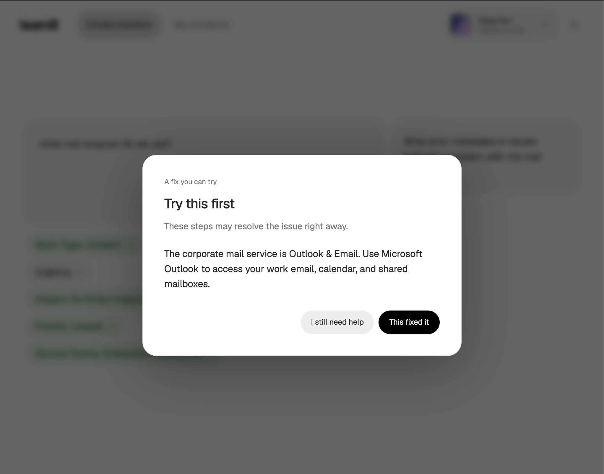
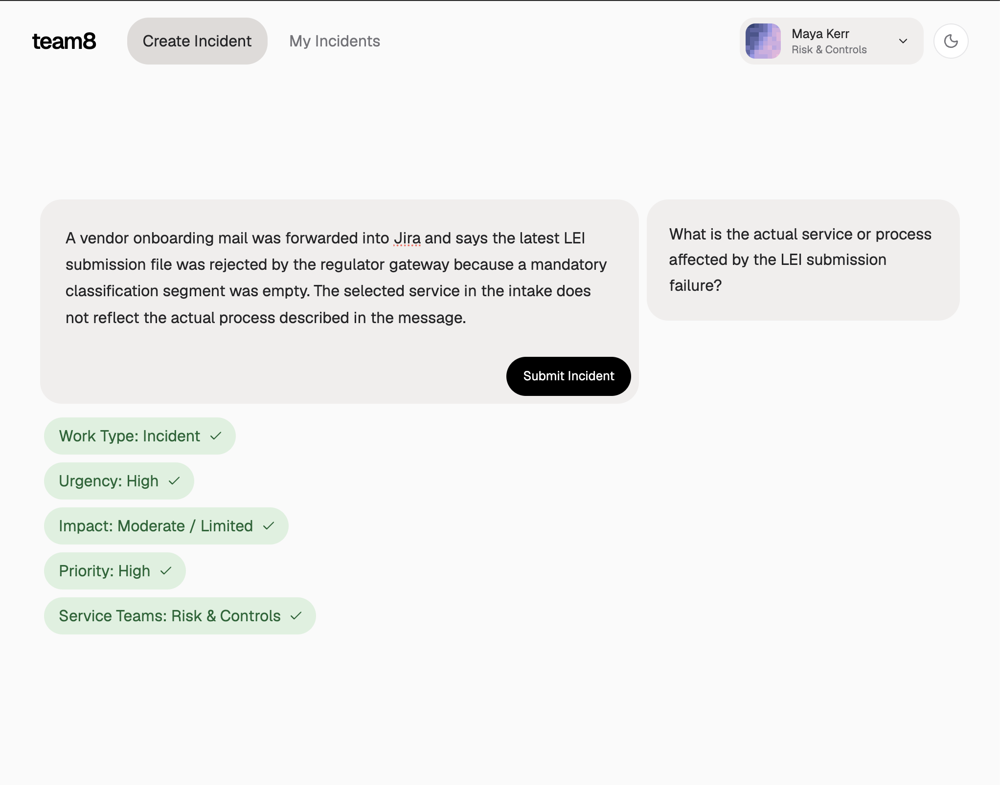
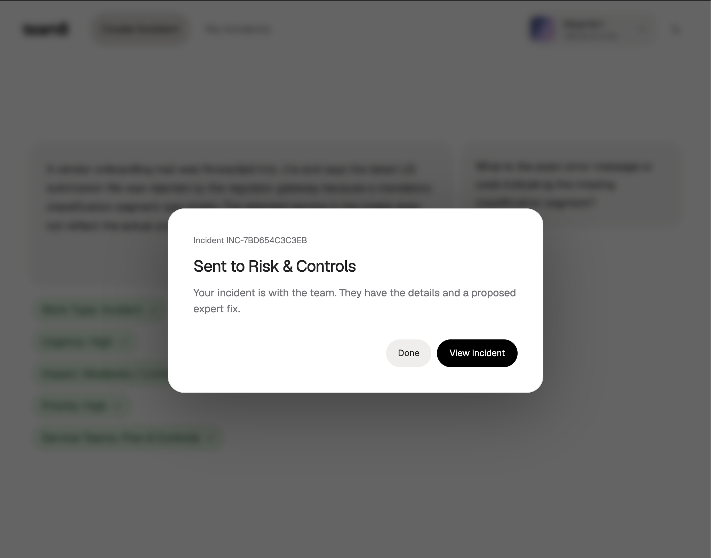
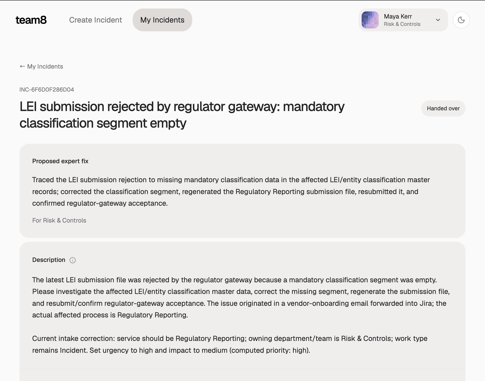
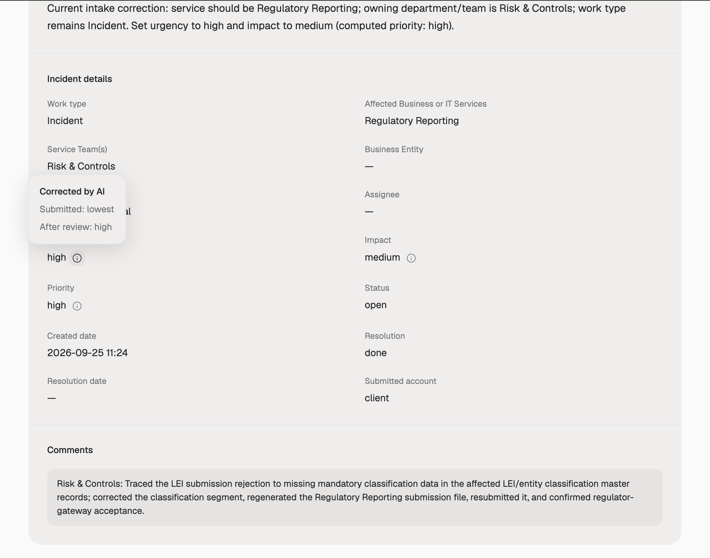

# Intake Screenshots

Two examples show how Intake handles a question the client can resolve immediately and a regulatory-reporting incident that needs an expert.

## Outlook: Client Resolution

The client asks which mail program to use. The resolution dialog identifies Microsoft Outlook for work email, calendars, and shared mailboxes. The client can accept the answer with **This fixed it** or request further help with **I still need help**.

## LEI Submission: Incident Intake and AI Guidance

A vendor-onboarding email reports that a regulator gateway rejected an LEI submission because a mandatory classification segment was empty. Intake populates the five classification chips and asks a follow-up question about the actual affected service or process.

## Handover to Risk & Controls

After review, the confirmation dialog identifies **Risk & Controls** as the receiving team and offers a link to the incident, including its proposed expert fix.

## Proposed Expert Resolution

The incident detail view places the proposed expert fix first: correct the missing classification data, regenerate the Regulatory Reporting submission, resubmit it, and confirm gateway acceptance. The clarified description appears below. This is a proposed resolution note; the incident is still marked **Handed over**.

## AI Field Corrections

The detail view shows the final routing, classification, and comments. An info tooltip records that urgency was submitted as **lowest** and corrected to **high** during review; impact and priority also have correction indicators.

[Back to the project README](../README.md)
